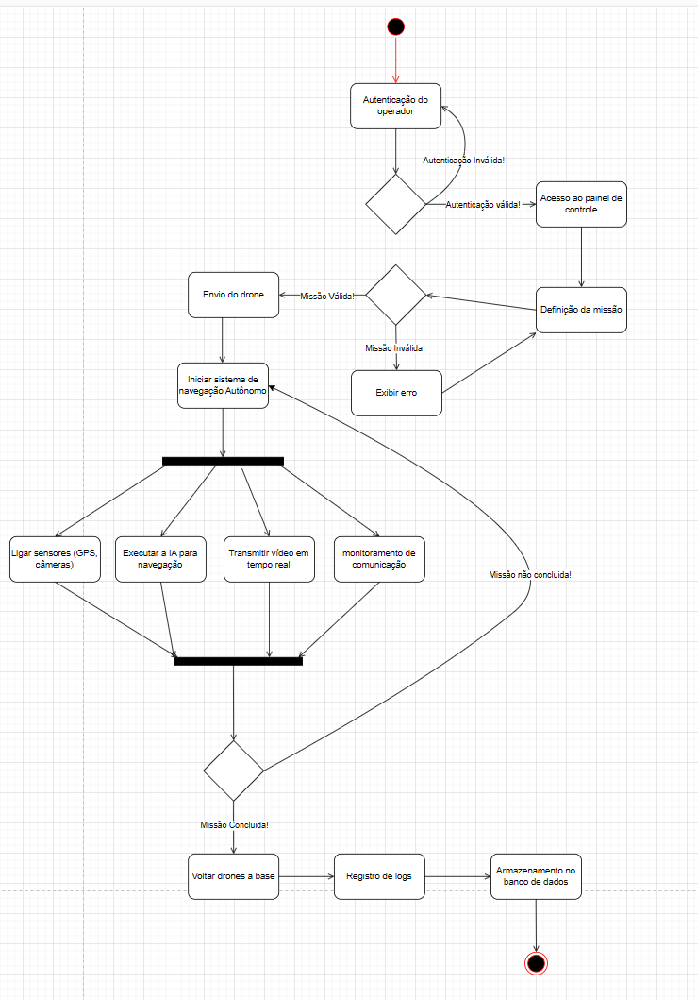
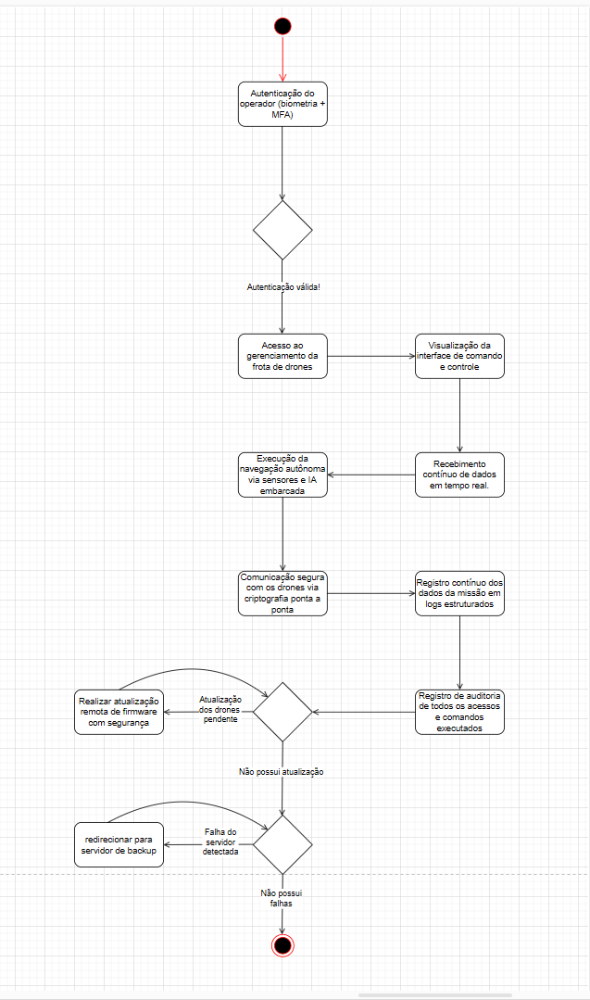
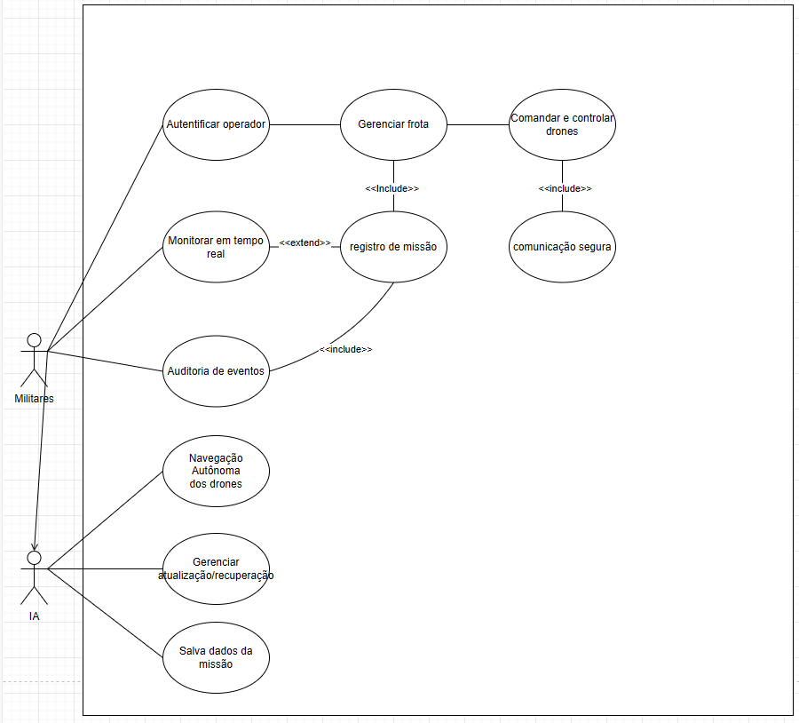

<h2><a href= "https://www.mackenzie.br">Universidade Presbiteriana Mackenzie</a></h2>
<h3><a href= "https://www.mackenzie.br/graduacao/sao-paulo-higienopolis/sistemas-de-informacao">Sistemas de Informação</a></h3>

*&lt;Sistema Falcão Sombrio para Drones&gt;*

**Conteúdo**

- [Autores](#autores)
- [Descrição do Projeto](#descrição-do-projeto)
- [Análise de Requisitos Funcionais e Não-Funcionais](#análise-de-requisitos-funcionais-e-não-funcionais)
    - [Requisitos Funcionais](#requisitos-funcionais)
    - [Requisitos Não Funcionais](#requisitos-não-funcionais)
- [Diagrama de Atividades](#diagrama-de-atividades)
- [Diagrama de Casos de Uso](#diagrama-de-casos-de-uso)
- [Descrição dos Casos de Uso](#descrição-dos-casos-de-uso)
    - [Autenticar operador](#autenticar-operador)
    - [Gerenciar frota](#gerenciar-frota)
    - [Comandar e controlar drones](#comandar-e-controlar-drones)
    - [Comunicação segura](#comunicação-segura)
    - [Registro de missão](#registro-de-missão)
    - [Monitorar em tempo real](#monitorar-em-tempo-real)
    - [Auditoria de eventos](#auditoria-de-eventos)
    - [Navegação Autônoma dos drones](#navegação-autônoma-dos-drones)
    - [Gerenciar atualização/recuperação](#gerenciar-atualizaçãorecuperação)
    - [Salva dados da missão](#salva-dados-da-missão)
- [Diagrama de Sequência](#diagrama-de-sequência)
- [Diagrama de Classes](#diagrama-de-classes)
- [Diagrama de Estados](#diagrama-de-estados)
- [Diagrama de Implantação](#diagrama-de-implantação)
- [Referências](#referências)

# Autores

João Pedro Mascaro Baccelli | RA: 10224004

# Descrição do Projeto

O Falcão Sombrio é um sistema avançado de controle e operação de drones bélicos autônomos desenvolvido para a empresa multinacional Securus Dynamics, especializada em soluções tecnológicas para defesa militar.

A iniciativa visa substituir a antiga arquitetura de software do Aquila-X — uma frota de drones equipados com inteligência artificial e sensores de última geração — por uma plataforma robusta, segura e distribuída, com foco em tempo real, autonomia, segurança cibernética e escalabilidade.

# Análise de Requisitos Funcionais e Não-Funcionais
### Requisitos Funcionais

| Área                        | Código  | Requisito                                                                 |
|----------------------------|---------|---------------------------------------------------------------------------|
| Central de Controle        | RF01    | Gerenciamento de frotas de drones.                                       |
|                            | RF02    | Controle remoto e autônomo dos drones.                                   |
|                            | RF03    | Dashboard em tempo real com telemetria.                                  |
|                            | RF04    | Definição de zonas de voo e restrições geográficas.                      |
|                            | RF05    | Configuração de missões pré-programadas.                                 |
|                            | RF06    | Sistema de alerta para falhas críticas.                                  |
|                            | RF07    | Atribuição de missões a grupos de drones.                                |
|                            | RF08    | Relatórios de desempenho e eficiência operacional.                       |
| Sistema de Navegação       | RF09    | Sensoriamento via LIDAR, câmeras e GPS.                                  |
|                            | RF10    | Detecção e evasão de ameaças em tempo real.                              |
|                            | RF11    | Operação autônoma baseada em redes neurais.                              |
|                            | RF12    | Identificação e rastreamento de alvos móveis.                            |
|                            | RF13    | Ajuste de rota com base em mudanças ambientais e ameaças.                |
|                            | RF14    | Detecção de obstáculos e manobras evasivas.                              |
|                            | RF15    | Suporte a múltiplos modos de navegação.                                  |
|                            | RF16    | Redundância nos sensores para garantir precisão.                         |
| Gerenciamento de Comunicação| RF17   | Comunicação segura em tempo real.                                        |
|                            | RF18    | Mecanismos de fallback para perda de conexão.                            |
|                            | RF19    | Comunicação via satélite em áreas remotas.                               |
|                            | RF20    | Garantia de integridade dos pacotes de dados.                            |
|                            | RF21    | Sincronização de dados para drones offline.                              |
|                            | RF22    | Suporte a múltiplos canais de comunicação.                               |
|                            | RF23    | Verificação da qualidade do sinal e realocação dinâmica de servidores.   |
| Banco de Dados e Auditoria | RF24    | Logs de missões e eventos críticos.                                      |
|                            | RF25    | Criptografia dos dados e assinaturas digitais.                           |
|                            | RF26    | Banco NoSQL distribuído para dados em tempo real.                        |
| Sistemas Embarcados        | RF27    | Autenticação via biometria e multifator.                                 |
|                            | RF28    | Monitoramento de processos do SO embarcado.                              |

### Requisitos Não Funcionais

| Categoria       | Código  | Requisito                                                                 |
|----------------|---------|---------------------------------------------------------------------------|
| Segurança       | RNF01   | Criptografia de ponta a ponta na comunicação.                            |
|                 | RNF02   | Autenticação multifatorial para maior segurança.                         |
| Desempenho      | RNF03   | Baixa latência entre drones e central.                                   |
|                 | RNF04   | Processamento em tempo real com alta disponibilidade.                     |
| Escalabilidade  | RNF05   | Suporte a grande quantidade de drones simultâneos.                        |
|                 | RNF06   | Expansão eficiente dos servidores distribuídos.                           |
| Disponibilidade | RNF07   | Alta disponibilidade com redundância nos componentes críticos.            |
|                 | RNF08   | Mecanismos de fallback para garantir continuidade operacional.            |
| Usabilidade     | RNF09   | Interface operacional avançada e intuitiva.                               |
|                 | RNF10   | Gerenciamento e controle acessíveis e claros para o operador.             |
| Conformidade    | RNF11   | Conformidade com normas legais e de privacidade.                          |
|                 | RNF12   | Aderência a padrões de segurança e auditoria militar.                     |

# Diagrama de Atividades

# Diagrama de Casos de Uso

# Descrição dos Casos de Uso

### Autenticar operador
**Ator:** Militares  
**Descrição:** Valida o acesso do operador militar ao sistema através de autenticação com credenciais e/ou biometria.  
**Fluxo Principal:**
1. O operador informa suas credenciais.
2. O sistema valida a autenticação.
3. Caso válido, o acesso é concedido.

### Gerenciar frota
**Ator:** Militares  
**Descrição:** Permite o controle da frota de drones cadastrados, atribuindo funções e organizando grupos.  
**Inclusões:** Registro de missão  
**Dependência:** Autenticação válida.

### Comandar e controlar drones
**Ator:** Militares  
**Descrição:** Envia comandos diretos para os drones ou inicia modo de operação autônoma.  
**Inclusões:** Comunicação segura  

### Comunicação segura
**Ator:** Militares  
**Descrição:** Garante a troca de mensagens com criptografia entre o operador e os drones.

### Registro de missão
**Atores:** Militares, IA  
**Descrição:** Armazena detalhes das missões, como localização, tempo, status e eventos ocorridos.

### Monitorar em tempo real
**Ator:** Militares  
**Descrição:** Permite acompanhar ao vivo a operação dos drones durante a missão.  
**Extensão de:** Registro de missão

### Auditoria de eventos
**Ator:** Militares  
**Descrição:** Acompanha eventos importantes durante a missão para posterior revisão e análise.

### Navegação Autônoma dos drones
**Ator:** IA  
**Descrição:** Controla o deslocamento automático dos drones, ajustando a rota com base nos dados de sensores e IA.

### Gerenciar atualização/recuperação
**Ator:** IA  
**Descrição:** Permite que a IA realize atualizações automáticas ou recuperação de falhas no sistema do drone.

### Salva dados da missão
**Ator:** IA  
**Descrição:** Armazena todos os dados relevantes da missão de forma segura para posterior análise.

# Diagrama de Sequência

*&lt;Diagrama de ordem e interação dos objetos&gt;*

# Diagrama de Classes

*&lt;Diagrama de relacionamento entre classes para os seus atributos e operações&gt;*

# Diagrama de Estados

*&lt;Diagrama para permite modelar o comportamento interno de um determinado objeto, subsistema ou sistema global&gt;*

# Diagrama de Implantação

*&lt;Diagrama para exibir o relacionamento de hardware e software no projeto&gt;*

# Referências

*&lt;Lista de referências&gt;*
